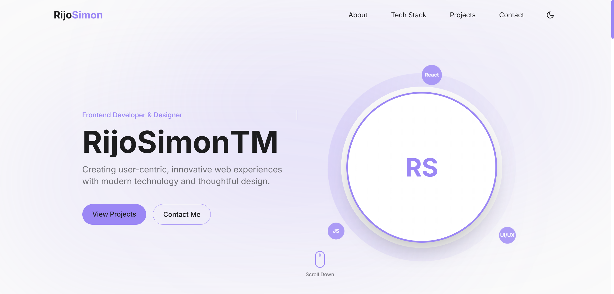

# Rijo Simon's Portfolio 🚀

[](https://rijosimon.netlify.app/)
[](https://reactjs.org/)
[](https://tailwindcss.com/)

A modern, responsive portfolio website showcasing my work as a Frontend Developer & Designer.



## ✨ Features

- 🎨 Modern and clean design
- 📱 Fully responsive layout
- 🌓 Dark/Light mode toggle
- 🔄 Smooth animations and transitions
- ⚡ Fast loading and performance
- 📧 Contact form integration

## 🛠️ Built With

- React.js
- Tailwind CSS
- Email.js
- Lucide Icons
- Framer Motion

## 🚀 Quick Start

1. Clone the repository:
```bash
git clone https://github.com/your-username/your-portfolio.git
```
2. Install dependencies:
```bash
npm install
```
4. Start the development server:
```bash
npm run dev
```
## 📂 Project Structure
## 🎯 Key Sections
- Hero : Dynamic introduction with animated text
- About : Professional background and skills
- Projects : Showcase of recent work
- Contact : Email contact form
## 📝 License
This project is open source and available under the MIT License .

## 🤝 Connect With Me
Designed & Built with ❤️ by Rijo Simon
 ```
